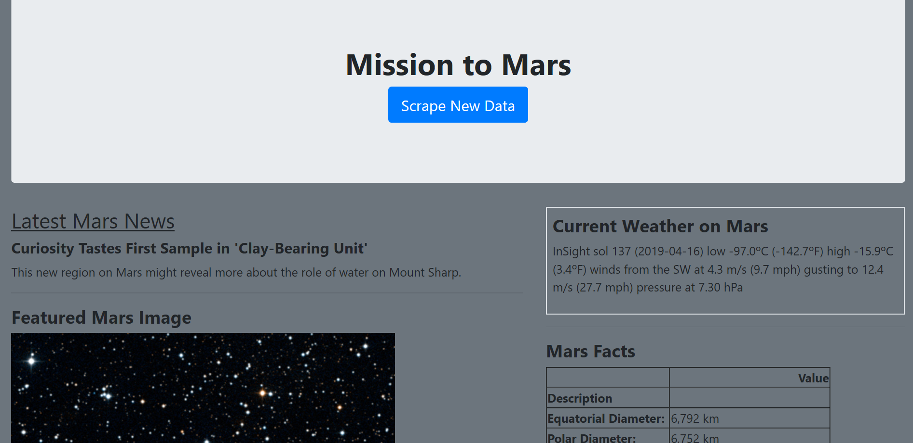
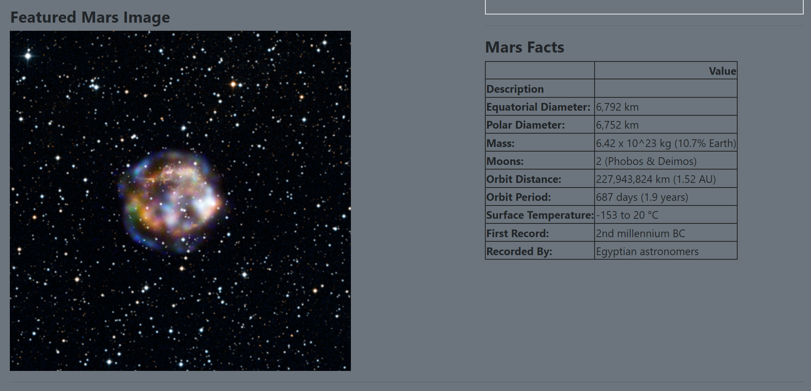
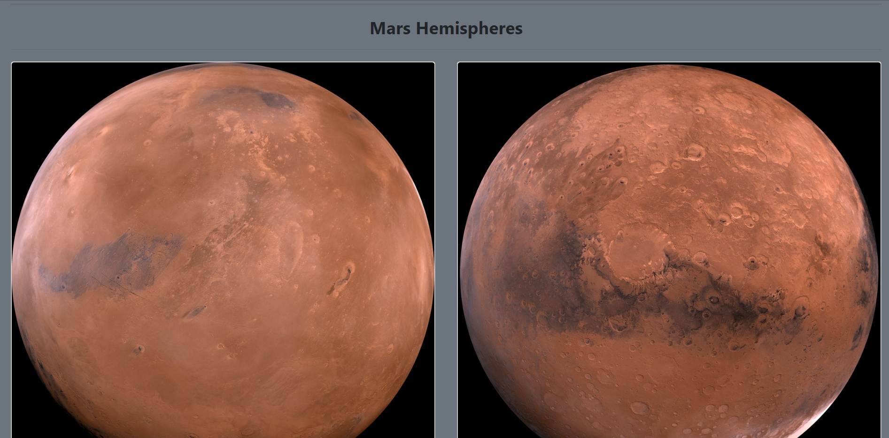
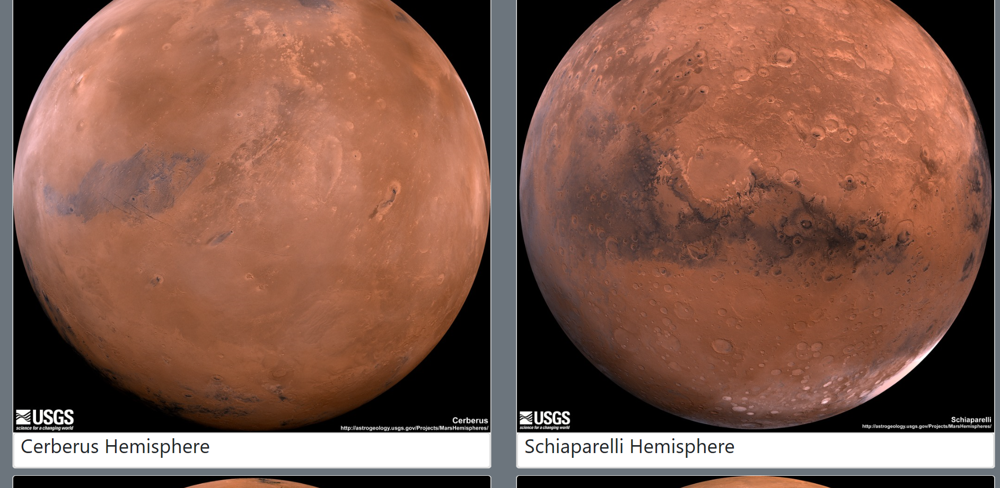
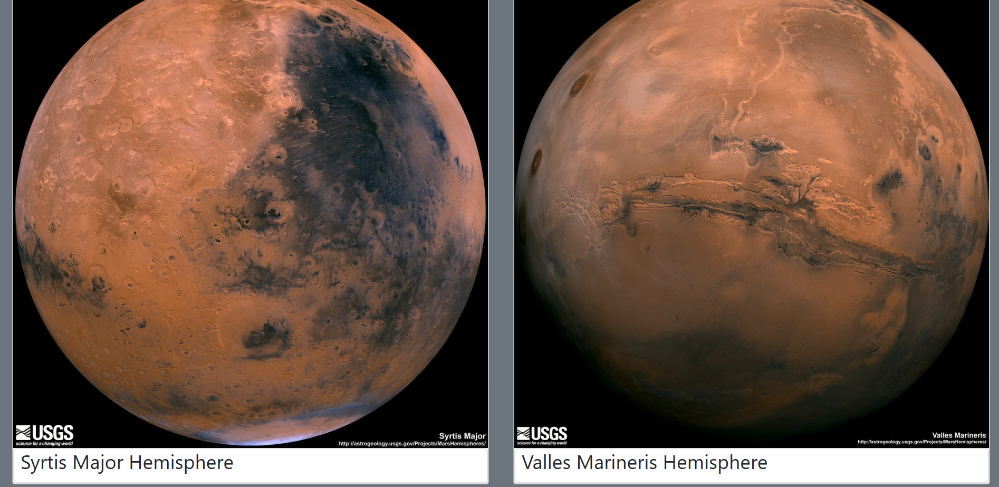

In this project, Beautiful Soup, Selenium and Splinter were used to scrape images and information about Mars from various websites and save them into MongoDB. 
The scraped information in MongoDB was displayed in a single HTML webpage using Flask.

## Jupyter Notebook: Scraping Code

```python
from splinter import Browser
from bs4 import BeautifulSoup as bs
from selenium import webdriver
import time
import pandas as pd
```


```python
def init_browser():

    # @NOTE: Replace the path with your actual path to the geckodriver
    executable_path = {"executable_path": r"C:/Drivers/geckodriver/geckodriver.exe"}
    return Browser("firefox", **executable_path, headless=False)
```

### NASA Mars News

```python
# Visit the NASA Mars News Site and scrape the latest news title and paragraph text
def scrape_mars_news():

    browser = init_browser()

    # Visit https://mars.nasa.gov/news/
    url = "https://mars.nasa.gov/news/"
    browser.visit(url)

    time.sleep(1)

    # Scrape page into Soup
    html = browser.html
    soup = bs(html, "html.parser")

    # Get the latest news title
    news_title = soup.find('div', class_='content_title').text

    # Get the latest news paragraph text
    news_p = soup.find('div', class_='article_teaser_body').text

    # Store data in a dictionary
    mars_news_data = {
        "news_title": news_title,
        "news_p": news_p
    }

    # Close the browser after scraping
    browser.quit()

    # Return results
    return mars_news_data
```


```python
# Test scrape_mars_news function
mars_news= scrape_mars_news()
print(mars_news)
```

    {'news_title': "Curiosity Tastes First Sample in 'Clay-Bearing Unit'", 'news_p': 'This new region on Mars might reveal more about the role of water on Mount Sharp.'}
    

### JPL Mars Space Images - Featured Image

```python
# Visit JPL NASA and scrape current JPL featured space image 
def scrape_mars_image():

    browser = init_browser()

    # Visit https://www.jpl.nasa.gov/spaceimages/?search=&category=Mars
    base_url = "https://www.jpl.nasa.gov"
    search_path = "/spaceimages/?search=&category=Mars"
    url = base_url + search_path
    browser.visit(url)

    time.sleep(1)

    # Scrape page into Soup
    html = browser.html
    soup = bs(html, "html.parser")

    # Find the src for the featured space image
    relative_image_path = soup.find('a', id='full_image')['data-fancybox-href']

    # Build full path to featured space image
    featured_img = base_url + relative_image_path

    # Store data in a dictionary
    mars_image = {
        "featured_img": featured_img
    }

    # Close the browser after scraping
    browser.quit()

    # Return results
    return mars_image
```


```python
# Test scrape_mars_images function
mars_image= scrape_mars_images()
print(mars_image)
```

    {'featured_img': 'https://www.jpl.nasa.gov/spaceimages/images/mediumsize/PIA20318_ip.jpg'}
    

### Mars Weather

```python
def scrape_mars_weather():

    browser = init_browser()

    # Visit https://twitter.com/marswxreport?lang=en)
    url = "https://twitter.com/marswxreport?lang=en)"
    browser.visit(url)

    time.sleep(1)

    # Scrape page into Soup
    html = browser.html
    soup = bs(html, "html.parser")
    
    # Get first tweet text about Mars weather
    mars_weather = soup.find('p', class_='tweet-text')
    
    # Remove text inside <a> tag
    mars_weather = ''.join(text for text in mars_weather.find_all(text=True) if text.parent.name != "a")
    
    # Remove \n newlines
    mars_weather = mars_weather.replace('\n', ' ')

    mars_weather_data = {
        "mars_weather": mars_weather
    }

    # Close the browser after scraping
    browser.quit()

    # Return results
    return mars_weather_data
```


```python
# Test scrape_mars_weather function
mars_weather = scrape_mars_weather()
print(mars_weather)
```

    {'mars_weather': 'InSight sol 136 (2019-04-14) low -97.3ºC (-143.2ºF) high -16.5ºC (2.4ºF) winds from the WNW at 4.3 m/s (9.6 mph) gusting to 10.8 m/s (24.2 mph) pressure at 7.30 hPa'}
    

### Mars Facts

```python
# Visit the Mars Facts webpage and use Pandas to scrape the table containing facts about the planet including Diameter, Mass, etc.

# Visit https://space-facts.com/mars/
url = 'https://space-facts.com/mars/'

# Use Panda's `read_html` to parse the url
tables = pd.read_html(url)
tables
```


    [                      0                              1
     0  Equatorial Diameter:                       6,792 km
     1       Polar Diameter:                       6,752 km
     2                 Mass:  6.42 x 10^23 kg (10.7% Earth)
     3                Moons:            2 (Phobos & Deimos)
     4       Orbit Distance:       227,943,824 km (1.52 AU)
     5         Orbit Period:           687 days (1.9 years)
     6  Surface Temperature:                  -153 to 20 °C
     7         First Record:              2nd millennium BC
     8          Recorded By:           Egyptian astronomers]


```python
# Create dataframe and rename columns
df = tables[0]
df.rename(columns={0: "Description", 1: "Value"}, inplace=True)
df = df.set_index('Description')
df
```


<div>
<style scoped>
    .dataframe tbody tr th:only-of-type {
        vertical-align: middle;
    }

    .dataframe tbody tr th {
        vertical-align: top;
    }

    .dataframe thead th {
        text-align: right;
    }
</style>
<table border="1" class="dataframe">
  <thead>
    <tr style="text-align: right;">
      <th></th>
      <th>Value</th>
    </tr>
    <tr>
      <th>Description</th>
      <th></th>
    </tr>
  </thead>
  <tbody>
    <tr>
      <th>Equatorial Diameter:</th>
      <td>6,792 km</td>
    </tr>
    <tr>
      <th>Polar Diameter:</th>
      <td>6,752 km</td>
    </tr>
    <tr>
      <th>Mass:</th>
      <td>6.42 x 10^23 kg (10.7% Earth)</td>
    </tr>
    <tr>
      <th>Moons:</th>
      <td>2 (Phobos &amp; Deimos)</td>
    </tr>
    <tr>
      <th>Orbit Distance:</th>
      <td>227,943,824 km (1.52 AU)</td>
    </tr>
    <tr>
      <th>Orbit Period:</th>
      <td>687 days (1.9 years)</td>
    </tr>
    <tr>
      <th>Surface Temperature:</th>
      <td>-153 to 20 °C</td>
    </tr>
    <tr>
      <th>First Record:</th>
      <td>2nd millennium BC</td>
    </tr>
    <tr>
      <th>Recorded By:</th>
      <td>Egyptian astronomers</td>
    </tr>
  </tbody>
</table>
</div>


```python
# Convert dataframe to HTML and remove \n newlines
html_table = df.to_html()
html_table = html_table.replace('\n', '')
html_table
```


    '<table border="1" class="dataframe">  <thead>    <tr style="text-align: right;">      <th></th>      <th>Value</th>    </tr>    <tr>      <th>Description</th>      <th></th>    </tr>  </thead>  <tbody>    <tr>      <th>Equatorial Diameter:</th>      <td>6,792 km</td>    </tr>    <tr>      <th>Polar Diameter:</th>      <td>6,752 km</td>    </tr>    <tr>      <th>Mass:</th>      <td>6.42 x 10^23 kg (10.7% Earth)</td>    </tr>    <tr>      <th>Moons:</th>      <td>2 (Phobos &amp; Deimos)</td>    </tr>    <tr>      <th>Orbit Distance:</th>      <td>227,943,824 km (1.52 AU)</td>    </tr>    <tr>      <th>Orbit Period:</th>      <td>687 days (1.9 years)</td>    </tr>    <tr>      <th>Surface Temperature:</th>      <td>-153 to 20 °C</td>    </tr>    <tr>      <th>First Record:</th>      <td>2nd millennium BC</td>    </tr>    <tr>      <th>Recorded By:</th>      <td>Egyptian astronomers</td>    </tr>  </tbody></table>'


```python
# Visit the Mars Facts webpage and use Pandas to scrape the table containing facts about the planet including Diameter, Mass, etc.
def scrape_mars_facts():

    url = 'https://space-facts.com/mars/'

    # Use Panda's `read_html` to parse the url
    mars_table = pd.read_html(url)

    # Create dataframe, rename columns, and set index to Description
    mars_df = mars_table[0]
    mars_df.rename(columns={0: 'Description', 1: 'Value'}, inplace=True)
    mars_df = mars_df.set_index('Description')

    # Convert dataframe to HTML and remove \n newlines
    mars_html_table = mars_df.to_html()
    mars_html_table = mars_html_table.replace('\n', '')
    
    # Return results
    return mars_html_table
```


```python
# Test scrape_mars_facts function
mars_facts = scrape_mars_facts()
mars_facts
```


    '<table border="1" class="dataframe">  <thead>    <tr style="text-align: right;">      <th></th>      <th>Value</th>    </tr>    <tr>      <th>Description</th>      <th></th>    </tr>  </thead>  <tbody>    <tr>      <th>Equatorial Diameter:</th>      <td>6,792 km</td>    </tr>    <tr>      <th>Polar Diameter:</th>      <td>6,752 km</td>    </tr>    <tr>      <th>Mass:</th>      <td>6.42 x 10^23 kg (10.7% Earth)</td>    </tr>    <tr>      <th>Moons:</th>      <td>2 (Phobos &amp; Deimos)</td>    </tr>    <tr>      <th>Orbit Distance:</th>      <td>227,943,824 km (1.52 AU)</td>    </tr>    <tr>      <th>Orbit Period:</th>      <td>687 days (1.9 years)</td>    </tr>    <tr>      <th>Surface Temperature:</th>      <td>-153 to 20 °C</td>    </tr>    <tr>      <th>First Record:</th>      <td>2nd millennium BC</td>    </tr>    <tr>      <th>Recorded By:</th>      <td>Egyptian astronomers</td>    </tr>  </tbody></table>'


### Mars Hemispheres

```python
# Visit the USGS Astrogeology site to obtain high resolution images for each of Mars hemispheres and their image urls
def scrape_mars_hemispheres():

    # Set up hemisphere image urls list
    hemisphere_image_urls = []
    
    browser = init_browser()

    # Visit https://astrogeology.usgs.gov/search/results?q=hemisphere+enhanced&k1=target&v1=Mars
    url = "https://astrogeology.usgs.gov/search/results?q=hemisphere+enhanced&k1=target&v1=Mars"
    browser.visit(url)
    
    time.sleep(1)

    # Design an XPATH selector to grab the link to the hemisphere webpage
    xpath = '//div[@class="item"]//a[@class="itemLink product-item"]/img'
    
    # Use splinter to click on the hemisphere link to access the webpage with the full resolution image
    results = browser.find_by_xpath(xpath)
    
    # Loop through each hemisphere link
    for i in range(len(results)):
        
        link = results[i]
        link.click()

        # Scrape page into Soup
        html = browser.html
        soup = bs(html, "html.parser")

        # Get hemisphere name
        hemisphere_name = soup.find('h2', class_='title').text

        # Remove word 'Enhanced'
        hemisphere_name = hemisphere_name.replace(' Enhanced', '')      
    
        # Get the link for the featured space image 
        img_item = soup.select_one('.downloads li a')
        img_url = img_item['href']

        # Store data in a dictionary
        hemisphere_info = {
            "title" : hemisphere_name,
            "img_url" : img_url
        }

        # Append dictionary to the url list
        hemisphere_image_urls.append(hemisphere_info)
    
        # Check if there are more results to scrape
        if i != (len(results) - 1):
            
            # Go back to the main page
            browser.visit(url)
        
            # Design an XPATH selector to grab the link to the hemisphere webpage
            xpath = '//div[@class="item"]//a[@class="itemLink product-item"]/img'
    
            # Use splinter to click on the hemisphere link to access the webpage with the full resolution image
            results = browser.find_by_xpath(xpath)
        
        else:
        
            # Close the browser after scraping all the hemisphere info
            browser.quit()

    # Return results
    return hemisphere_image_urls
```


```python
# Test scrape_mars_hemispheres function
mars_hemispheres= scrape_mars_hemispheres()
print(mars_hemispheres)
```

    [{'title': 'Cerberus Hemisphere', 'img_url': 'http://astropedia.astrogeology.usgs.gov/download/Mars/Viking/cerberus_enhanced.tif/full.jpg'}, {'title': 'Schiaparelli Hemisphere', 'img_url': 'http://astropedia.astrogeology.usgs.gov/download/Mars/Viking/schiaparelli_enhanced.tif/full.jpg'}, {'title': 'Syrtis Major Hemisphere', 'img_url': 'http://astropedia.astrogeology.usgs.gov/download/Mars/Viking/syrtis_major_enhanced.tif/full.jpg'}, {'title': 'Valles Marineris Hemisphere', 'img_url': 'http://astropedia.astrogeology.usgs.gov/download/Mars/Viking/valles_marineris_enhanced.tif/full.jpg'}]
    


## Mission to Mars Website using MongoDB with Flask Templating










